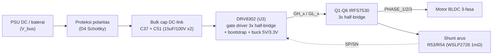
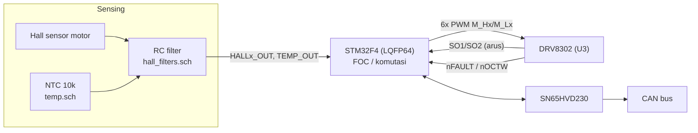

# Development Docs — Upgrade Driver BLDC (VESC 4.12 / DRV8302) ke 5 kW

Dokumen tunggal untuk skripsi: **alur kerja** rangkaian referensi, **baseline**
(kenapa hanya 1.5–2.5 kW), **prosedur & perhitungan** upgrade ke motor 5 kW, dan
**rencana development** ke depan. Menggabungkan catatan sebelumnya
(`power-budget.md`, `perhitungan-driver.md`, `5kw-driver-upgrade.md`,
`roadmap-5kw-upgrade.md`). Semua angka di sini adalah angka yang dipakai di slide
presentasi (`docs/presentasi-upgrade-5kw.pptx`).

---

## 0. Status & asumsi

| Item | Status |
|---|---|
| Rangkaian referensi | VESC 4.12 (Benjamin Vedder), disalin ke `hardware/design/` (KiCad, 7 sheet) |
| Target | Motor BLDC rating **5 kW** (permintaan pembimbing) |
| Sumber daya | **Power supply DC lab** (bukan baterai), tegangan **belum dikunci** |
| Asumsi kerja | **V_bus = 48 V**, P_input ≈ 5.5 kW (5 kW output / ~90 % efisiensi motor+inverter) |
| Blocker | Konfirmasi tegangan PSU & rating tegangan/arus winding motor |

> Kalau tegangan final berbeda dari 48 V, semua arus di §4–§6 diskalakan ulang
> dengan `I = P / V` (arus berbanding terbalik dengan tegangan).

---

## 1. Alur kerja rangkaian referensi

Project `BLDC_4.pro` punya 7 sheet (1 top-level + 6 sub-sheet):

```
BLDC_4.sch (top level)
├─ STM32F4 64LQFP.sch   "MCU"                 — kendali FOC/six-step, ADC, PWM
├─ hall_filters.sch     "Filters"             — RC filter hall (10k + 4n7) & suhu
├─ Power.sch             "Mosfet driver"       — DRV8302 (U3) + shunt + bootstrap cap
├─ mosfets.sch           "Power MOSFETS"       — Q1–Q6 (6× IRFS7530) + gate resistor
├─ CAN.sch               "CAN bus transceiver" — SN65HVD230
└─ temp.sch              "NTC temp sensor"     — divider NTC 10k
```

### 1a. Jalur daya



### 1b. Jalur sinyal & kendali



Ringkas: **daya** mengalir PSU → bulk cap → DRV8302 → MOSFET half-bridge → fasa
motor; **sinyal** dua arah: MCU kirim PWM ke DRV8302, terima balik arus (SO1/SO2),
fault, posisi hall, dan suhu.

Untuk upgrade 5 kW, **hanya `Power.sch` dan `mosfets.sch` yang berubah**. Sheet
MCU/hall/CAN/temp tetap, asalkan rentang sinyal ke ADC dijaga sama (lihat §6.2 GAIN).

### 1c. Catatan konsep: bootstrap high-side

MOSFET N-channel nyala kalau `V_GS > V_th` (gate ~10 V di atas **source**). Source
Q1 (high-side) bukan di GND, tapi di node fasa yang naik sampai ≈ V_bus saat Q1 ON →
gate harus di ≈ V_bus + 10 V, lebih tinggi dari suplai IC sendiri. Solusinya cap
bootstrap `C_BST` antara `BST_x`–`SH_x`:
- Saat Q2 (low-side) ON, `SH_x` ≈ 0 V → C_BST di-charge ~10 V lewat diode internal.
- Saat Q1 ON, `SH_x` lompat ke V_bus, tegangan cap ikut terbawa → `BST_x` ≈ V_bus +
  10 V, dipakai sebagai suplai mengambang untuk `GH_x`.
Low-side (Q2) tidak butuh ini karena source-nya selalu di GND.

---

## 2. Baseline: kenapa board referensi hanya ≈ 1.5–2.5 kW

### 2.1 Komponen pembatas

| Ref | Komponen | Spek relevan |
|---|---|---|
| Q1–Q6 | IRFS7530-7PPbF, 1 per switch | Vdss 60 V, Rds(on) 1.15 mΩ typ, I_D 240 A (batas bond-wire), Pd 375 W |
| U3 | DRV8302 | operasi 8–60 V (abs. max 65 V), gate 1.7 A src / 2.3 A sink |
| R53, R54 | WSLP2726 1 mΩ ×2 | Pd **7 W** per paket |
| C37, C51 | 15 µF/100 V ×2 | 30 µF total |

### 2.2 Batas tegangan

MOSFET 60 V dan DRV8302 60 V operasi. Margin 15–20 % untuk spike/regen →
**praktis ≈ 50–54 V** (12S Li-Po full 50.4 V sudah mepet).

### 2.3 Batas arus — dihitung dari shunt

Shunt adalah pembatas kontinu pertama (bukan MOSFET):

```
P_shunt = I² × R          →  I_max = √(P_rating / R)
I_max   = √(7 W / 1 mΩ)   = √7000 ≈ 84 A per shunt
```

Derating 60–75 % untuk keandalan jangka panjang + pendinginan PCB tanpa heatsink:

```
I_kontinu ≈ 0.6–0.75 × 84 A ≈ 50–65 A per fasa
```

Cek MOSFET di titik itu (60 A):

```
P_cond = I² × Rds(on) = 60² × 1.15 mΩ ≈ 4.1 W per FET  →  6 FET ≈ 25 W total
```

≈ 4 W per D²Pak masih bisa dibuang lewat tembaga PCB saja — konsisten dengan
spek VESC 4.12 yang umum dipublikasikan (~50 A kontinu).

Burst (beberapa detik): label BOM `"MOSFET 60V 240A"`, praktik dengan pendinginan
referensi ≈ **150–200 A** singkat.

### 2.4 Estimasi daya (P = V × I)

| Skenario | V | I fasa | P |
|---|---|---|---|
| 6S | 22.2 V | ~50 A | **≈ 1.1 kW** |
| 10S | 37 V | ~55 A | **≈ 2.0 kW** |
| 12S | 44.4 V | ~60 A | **≈ 2.6 kW** |
| Burst beberapa detik, 12S | 44–50 V | 150–200 A | 7–10 kW |
| Batas mutlak komponen | 50 V | 240 A | 12 kW (tidak untuk kontinu) |

→ **Rating kontinu realistis ≈ 1.5–2.5 kW** (tergantung tegangan 6S–12S).
Untuk 5 kW kontinu board harus dinaikkan ≈ 2× arus.

---

## 3. Prosedur umum kalau rating daya diubah

Urutan hitung ulang yang **wajib** dijalankan — jangan cuma naikkan tegangan/arus
tanpa cek titik-titik ini. §4–§6 adalah penerapan konkretnya untuk 5 kW / 48 V.

1. **Kunci V_bus dulu**, lalu turunkan arus target:
   `I_fasa ≈ P_input / V_bus`, dengan `P_input ≈ P_output / η`, η ≈ 0.9.
   V_bus tinggi → arus kecil → upgrade lebih mudah, tapi tetap ≤ batas DRV8302/MOSFET.
2. **Cek rugi konduksi MOSFET**: `P_cond = I_fasa² × Rds(on)`. Kalau > ~10–15 W per
   device tanpa heatsink → paralel N buah:
   `I_per_device = I/N`, `Rds(on)_paralel = Rds(on)/N`, `P_leg = I² × Rds(on)_paralel`.
   Tiap FET tambahan wajib gate resistor sendiri.
3. **Cek gate drive**: Qg total naik N× → rise/fall naik N×; kalau f_sw tinggi atau N
   besar, naikkan dead time (R_DTC).
4. **Hitung ulang shunt**: `R_shunt = 1 mΩ / M`, `P_total = I² × R_shunt`,
   `P_per_paket = P_total / M` — naikkan M sampai jauh di bawah 7 W, termasuk burst.
5. **Set ulang GAIN**: `V_SO = I × R_shunt × Gain` (10 atau 40 V/V) — pilih agar
   tidak clipping saat burst (linear 0.3–5.7 V).
6. **Hitung ulang OC_ADJ**: `V_DS_trip = R2/(R1+R2) × 3.3 V`,
   `I_OC = V_DS_trip / Rds(on)_paralel_hot` — pakai Rds(on) ~100 °C, verifikasi di meja.
7. **Naikkan yang lain**: bulk cap, tembaga PCB/thermal via/heatsink, konektor & fuse.

```
naik P_motor -> (V_bus tetap) naik I_fasa
             -> naik P_cond per MOSFET (kuadratik, I²)
             -> paralel MOSFET (N) -> ubah Rds(on) efektif & Qg total
             -> ubah shunt (M paralel) supaya P_shunt aman
             -> ubah GAIN supaya V_SO tidak clipping
             -> ubah OC_ADJ (R1/R2) mengikuti Rds(on) paralel baru
             -> naikkan bulk cap, tembaga PCB, heatsink, konektor/fuse
```

---

## 4. Target 5 kW — arus fasa

```
I_fasa ≈ P_input / V_bus
```

| V_bus | I fasa kontinu @ 5.5 kW | Catatan |
|---|---|---|
| 24 V | ≈ 229 A | tidak praktis |
| 36 V | ≈ 153 A | berat tapi feasible |
| **48 V** | **≈ 115 A** | **titik desain** — margin ke batas 60 V |
| 60 V | ≈ 92 A | arus ringan, tapi tanpa margin ke batas operasi DRV8302 |

Di 48 V:

```
I_kontinu ≈ 5500 / 48 ≈ 115 A          (≈ 2× baseline 55–65 A)
I_burst   ≈ 2–3 × I_kontinu ≈ 230–345 A
```

Rekomendasi ke pembimbing: PSU 48 V (maks ≤ 55 V agar ada margin ke abs. max 65 V).

---

## 5. MOSFET — harus diparalel

Rugi konduksi kuadratik terhadap arus: `P = I² × Rds(on)`.

```
1 FET @115 A : 115² × 1.15 mΩ ≈ 15.2 W   (vs 4.1 W di baseline → ~3.7×)
               → tidak bisa dibuang D²Pak tunggal di PCB referensi
```

**Solusi: 2× IRFS7530 paralel per switch → 12 MOSFET.**

```
I per FET         ≈ 115 / 2 = 57.5 A       (kembali ke rentang baseline)
Rds(on) paralel   ≈ 1.15 / 2 = 0.575 mΩ
P_cond per leg    = 115² × 0.575 mΩ ≈ 7.6 W  (≈ 3.8 W per FET)
+ switching loss  ≈ 2–5 W per leg @ ~20 kHz (estimasi)
Total             ≈ 10–15 W per leg, ≈ 60–90 W untuk 6 leg → perlu heatsink
```

Dasar dari datasheet DRV8302: *"three half bridge drivers, each capable of driving
two N-channel MOSFETs"* — 2× paralel per leg adalah pola yang didukung IC,
tanpa gate buffer tambahan.

Aturan: **setiap FET punya gate resistor sendiri** (replikasi pola 4.7 Ω), tidak
berbagi satu resistor untuk dua gate (cegah osilasi / current hogging).

Opsi margin ekstra: 3× paralel (18 FET) untuk burst 300+ A dan T_j lebih rendah.

### Cek gate drive

Total Qg per transisi naik 2× → rise/fall time memanjang ≈ 2× (nominal 25 ns / 1 nF).
Masih wajar di ~20 kHz; kalau f_sw dinaikkan atau pakai 3× paralel, naikkan dead time
(R_DTC, rentang 50–500 ns). IC gate driver **tidak perlu diganti**.

---

## 6. Shunt, GAIN, OC_ADJ

### 6.1 Shunt (R53/R54)

| Konfigurasi | R total | P @ 115 A kontinu | P @ 300 A burst |
|---|---|---|---|
| 1× 1 mΩ (baseline) | 1 mΩ | 13.2 W — **> 7 W** | 90 W |
| 2× 1 mΩ paralel | 0.5 mΩ | 6.6 W (3.3 W/pkg) — mepet | 45 W (22.5 W/pkg) |
| **3× 1 mΩ paralel** | **0.333 mΩ** | **4.4 W (1.47 W/pkg)** | 30 W (10 W/pkg) — hanya beberapa detik, di bawah rating pulsa |

→ **3× WSLP2726 1 mΩ paralel, R_shunt ≈ 0.33 mΩ.**

### 6.2 GAIN (sense amp DRV8302 — hanya 2 pilihan: 10 atau 40 V/V)

```
V_SO = I × R_shunt × Gain
```

| GAIN pin | Gain | V_SO @ 115 A | V_SO @ 300 A |
|---|---|---|---|
| **LOW** | **10 V/V** | **0.38 V** | **1.0 V** — aman |
| HIGH | 40 V/V | 1.53 V | 4.0 V — clipping (Vswing linear 0.3–5.7 V, terpusat di REF/2) |

→ **GAIN = LOW (10 V/V).** Resolusi di arus kecil turun, tapi masih cukup untuk
FOC dengan ADC 12-bit STM32F4, dan rentang sinyal ke MCU tetap konsisten.

### 6.3 OC_ADJ (proteksi overcurrent berbasis V_DS, bukan shunt)

```
V_DS_trip = R2 / (R1 + R2) × 3.3 V      (R1 + R2 ≥ 1 kΩ, datasheet rev. C)
I_OC      = V_DS_trip / Rds(on)_leg
```

Target trip ≈ 300 A, pakai Rds(on) panas (≈ 0.75 mΩ paralel) agar tidak
nuisance-trip:

```
V_DS_trip = 300 × 0.75 mΩ ≈ 0.225 V  →  R2/(R1+R2) ≈ 0.068
Contoh: R1 = 13 kΩ, R2 = 1 kΩ  →  0.236 V
I_OC ≈ 314 A (panas, 0.75 mΩ) … 410 A (dingin, 0.575 mΩ)
```

Datasheet: toleransi trip point sampai 20 % antar channel → **wajib verifikasi
di meja** dengan current probe.

---

## 7. Perubahan fisik lain

| Item | Sekarang | Jadi |
|---|---|---|
| Bulk cap DC-link (C37/C51) | 30 µF total | Bank elco low-ESR (ribuan µF, jumlah rating ripple > ~0.3–0.5 × I_fasa) + ceramic 2.2 µF per leg dekat PVDD (pola layout contoh DRV8302). Ukuran final dari **uji ripple sistem**. |
| Tembaga PCB fasa & DC bus | 1–2 oz (asumsi) | 4 oz+ copper pour / bus bar, thermal via array di bawah pad tiap D²Pak |
| Heatsink | PCB saja | Heatsink terpasang ke bawah PCB (thermal pad) untuk ~60–90 W |
| Konektor & fuse | tidak diketahui | Konektor ≥ 150 A kontinu (lug/busbar), fuse/breaker sesuai |

---

## 8. Ringkasan sebelum → sesudah

| Sheet | Komponen | Baseline (≈ 2 kW) | Upgrade (5 kW) |
|---|---|---|---|
| `mosfets.sch` | Q1–Q6 | 1× IRFS7530 / switch (6) | 2× paralel / switch (12), gate resistor per FET |
| `Power.sch` | R53/R54 | 2× 1 mΩ | 3× 1 mΩ paralel (0.33 mΩ) |
| `Power.sch` | Pin GAIN | HIGH (40 V/V) | LOW (10 V/V) |
| `Power.sch` | R1/R2 OC_ADJ | nilai lama | R1 ≈ 13 k / R2 ≈ 1 k (verifikasi) |
| `Power.sch` | C37/C51 | 2× 15 µF | bank elco + ceramic per leg |
| Layout | tembaga / heatsink | standar | 4 oz+, thermal via, heatsink |
| — | konektor / fuse | — | ≥ 150 A |
| — | arus kontinu | 50–65 A | ≈ 115 A |
| — | daya kontinu | 1.5–2.5 kW | 5 kW @ 48 V |

---

## 9. Development — langkah ke depan

| # | Tahap | Output | Status |
|---|---|---|---|
| 1 | Kunci spesifikasi: tegangan PSU, rating winding motor 5 kW | angka V_bus final | ⬜ menunggu pembimbing |
| 2 | Edit `mosfets.sch`: Q1–Q6 → 12 posisi paralel + gate resistor masing-masing | skematik | ⬜ |
| 3 | Edit `Power.sch`: shunt 3×, GAIN LOW, R1/R2 OC_ADJ baru, bulk cap | skematik | ⬜ |
| 4 | Re-layout PCB: tembaga fasa/DC, thermal via, heatsink, footprint konektor | layout + gerber | ⬜ |
| 5 | Review angka §4–§7 dengan V_bus final | dokumen ini direvisi | ⬜ |
| 6 | Fabrikasi & assembly prototipe | board | ⬜ |
| 7 | Bring-up meja: kalibrasi V_SO vs arus, trip point OC_ADJ, ripple V_bus | data uji | ⬜ |
| 8 | Uji motor 5 kW bertahap (arus rendah → rating penuh) sambil pantau suhu | data uji | ⬜ |

Sudah selesai sejauh ini: salin & konversi desain referensi ke `hardware/design/`,
analisis baseline (§2), prosedur & perhitungan upgrade (§3–§7), dokumen ini, slide
presentasi.

---

*Sumber: datasheet DRV8302 SLES267C (`hardware/docs/drv8302.pdf` — §6.1 abs. max,
§6.7 sense amp, §7.3.4.2 OC_ADJ, §9 bulk cap, §10 layout); datasheet IRFS7530-7PPbF
& WSLP2726 (`hardware/reference/vedderb-bldc-hardware/datasheets/`); skematik VESC
4.12 di `hardware/design/`.*
